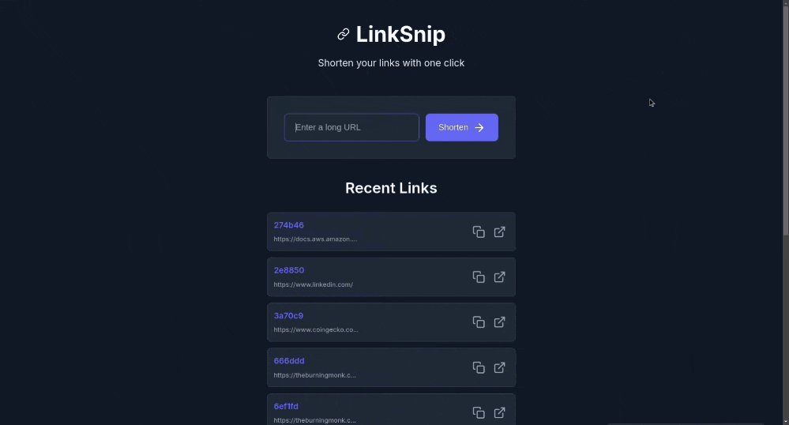

# AWS Edge URL Shortener

A serverless URL shortening service using AWS CloudFront Functions and CloudFront KeyValueStore for high-performance, low-latency URL redirections at the edge.

<div align="center">
  
</div>

## Architecture

This project implements a modern URL shortener service with the following components:

### Frontend
- **CloudFront Distribution**: Serves the web UI and handles URL redirects at edge locations
- **CloudFront Function**: Processes shortened URLs and performs redirects
- **CloudFront KeyValueStore**: Stores mappings between short URLs and their destinations
- **S3 Bucket**: Hosts the static website files

### Backend
- **API Gateway**: Provides RESTful API endpoints for URL management
- **Lambda Functions**: Process requests to create and list shortened URLs
- **CloudFront KeyValueStore Integration**: Backend services interface with the same KeyValueStore used by the edge functions

### Architecture Diagram

```
           ┌───────────┐                 ┌───────────────┐
 User ────►│ CloudFront│───Static Files─►│ S3 Website    │
           │           │                 │ Bucket        │
           └───────────┘                 └───────────────┘
                 │                              
                 │ Short URL Request             
                 ▼                              
         ┌───────────────┐           ┌───────────────┐
         │ CloudFront    │──Lookup──►│ CloudFront    │
         │ Function      │           │ KeyValueStore │
         └───────────────┘           └───────────────┘
                                           ▲
                                           │
           ┌───────────┐                   │
 API User ►│ API       │                   │
           │ Gateway   │                   │
           └───────────┘                   │
                 │                         │
                 ▼                         │
         ┌───────────────┐                 │
         │ Lambda        │─Write/Read──────┘
         │ Functions     │
         └───────────────┘
```

## Features

- ⚡ **Edge Processing**: Redirects happen at CloudFront edge locations for minimal latency
- 🌐 **Global Distribution**: Leverages AWS's global CDN networkoy.sh
- 🔄 **Serverless Architecture**: No servers to manage, scales automatically
- 📱 **Responsive UI**: Mobile-friendly web interface
- 📋 **URL History**: View and manage previously created short URLs4. Access your URL shortener at the CloudFront URL provided in the deployment outputs
- 📊 **API Integration**: RESTful API for programmatic access
- 🔒 **Secure by Default**: HTTPs for all communications## Usage
- 📈 **Cost Efficient**: Pay only for what you use with serverless
  
### Web Interface
## Getting Started
1. Open the CloudFront URL in your browser
### Prerequisites
 URL
- AWS CLI configured with appropriate permissions
- AWS SAM CLI installed
- Node.js 18+ and npm

### Deployment

1. Clone the repository

2. Check if you have SAM CLI and AWS CLI

3. Deploy using SAM (Serverless Application Model)
   ```bash
   sam build
   sam deploy --profile default # Change with your aws profile
   ```

4. Update frontend app.js with the api gateway endpoint
   ```javascript
   const API_URL = 'https://your-api-id.execute-api.your-region.amazonaws.com/Prod';
   ```

5. Use the script to deploy the frontend assets, but first update the script with your s3 name and aws profile
   ```bash
   bash front/scripts/deploy.sh
   ```

6. Access your URL shortener at the CloudFront URL provided in the deployment outputs

### API Endpoints

Check the docs/api.http

## Project Structure

```
aws-edge-url-shortner/
├── front/                  # Frontend code
│   ├── src/                # Source files
│   │   ├── index.html      # HTML template
│   │   ├── app.js          # Application logic
│   │   └── styles.css      # Styling
│   ├── scripts/            # Deployment scripts
│   └── template.yaml       # Frontend CloudFormation template
├── backend/                # Backend code
│   ├── src/                # Source files
│   │   ├── lambdas/        # Lambda handlers
│   │   ├── functions/      # Business logic
│   │   ├── shared/         # Shared utilities
│   │   └── aws-clients/    # AWS service clients
│   ├── layers/             # Lambda layers
│   └── template.yaml       # Backend CloudFormation template
└── template.yaml           # Main CloudFormation template
```

## How It Works

1. When a user visits a shortened URL (e.g., `https://d123abc.cloudfront.net/abc123`), the request is routed to the nearest CloudFront edge location
2. The CloudFront Function intercepts the request and extracts the short ID (`abc123`)
3. The function queries the CloudFront KeyValueStore to find the destination URL
4. If found, the function returns a 302 redirect to the destination URL
5. If not found, the function routes the request to the frontend application

### Technical Details

- **CloudFront KeyValueStore**: A new AWS service that provides low-latency, globally replicated key-value storage designed for use with CloudFront Functions
- **JS Runtime**: CloudFront Functions use the cloudfront-js-2.0 runtime which supports async/await and modern JavaScript features
- **Backend Integration**: Lambda functions use the CloudFront KeyValueStore API to create and manage URL mappings
- **Pagination**: The URL listing API supports pagination when dealing with large numbers of URLs

## Cost Considerations

This solution is designed to be cost-effective:

- **CloudFront Functions**: Charged per request, typically $0.10 per million requests
- **CloudFront Distribution**: Basic distribution costs plus data transfer
- **CloudFront KeyValueStore**: Storage costs plus read/write operations
- **Lambda Functions**: Pay only for execution time and invocations
- **API Gateway**: Pay per request
- **S3 Bucket**: Minimal storage costs for the static website

For a small to medium usage (up to 100k shortened URLs per month), estimated cost is typically under $5/month.

## Limitations

- CloudFront KeyValueStore has a maximum of 5MB total storage
- Currently limited to 50 URL mappings as configured in the backend code
- CloudFront Functions have a 10KB code size limit and 1ms CPU time limit

## Development

### Adding New Features

1. Fork the repository
2. Create a feature branch
3. Implement your changes
4. Test locally with SAM
5. Submit a pull request

## Contributing

Contributions are welcome! Please feel free to submit a Pull Request.

1. Fork the repository
2. Create your feature branch (`git checkout -b feature/amazing-feature`)
3. Commit your changes (`git commit -m 'Add some amazing feature'`)
4. Push to the branch (`git push origin feature/amazing-feature`)
5. Open a Pull Request

## License

This project is licensed under the MIT License - see the [LICENSE](LICENSE) file for details.